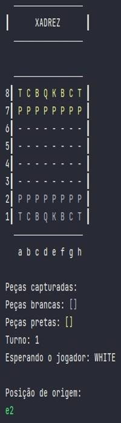
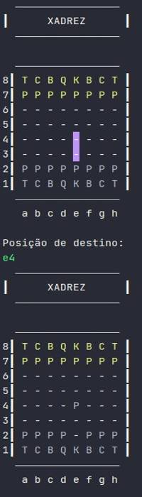

# Xadrez
## Descrição
Projeto de um jogo de Xadrez utilizando as técnicas de Programação Orientada a Objetos com auxílio do professor Nélio Alves.
## Visualização do projeto

## Ferramentas utilizadas
* Java
## Modelagem

